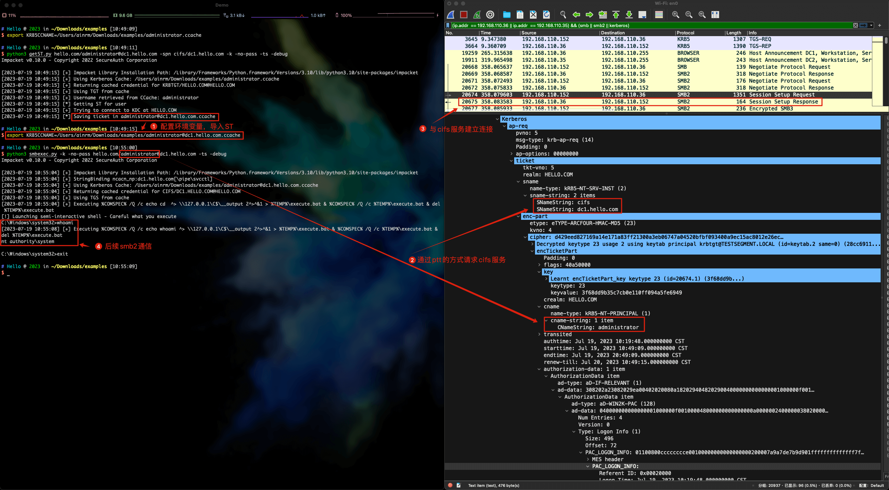

#### 0x01 说明

学习内网渗透，过程中产生的流量归档，包含：

- ntlm
  - pth
  - spray
  - llmnr
  - relay
  - printerbug-ntlm
  - petitPotam-ntlm
- kerberos
  - ptt
  - 非约束委派
  - 约束委派
  - 基于资源的约束委派
  - priterbug-kerberos
  - petitPotam-ecs8

示例：

#### 0x02 参考

- [内网渗透 - NTLM协议](https://ainrm.cn/2023/ntlm.html)

- [内网渗透 - KERBEROS协议](https://ainrm.cn/2023/kerberos.html)

